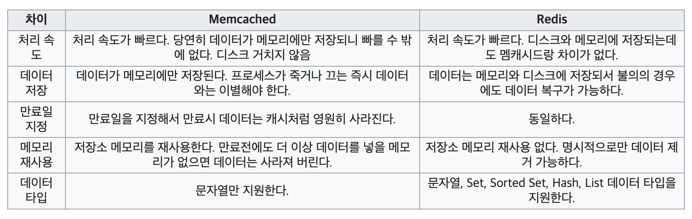
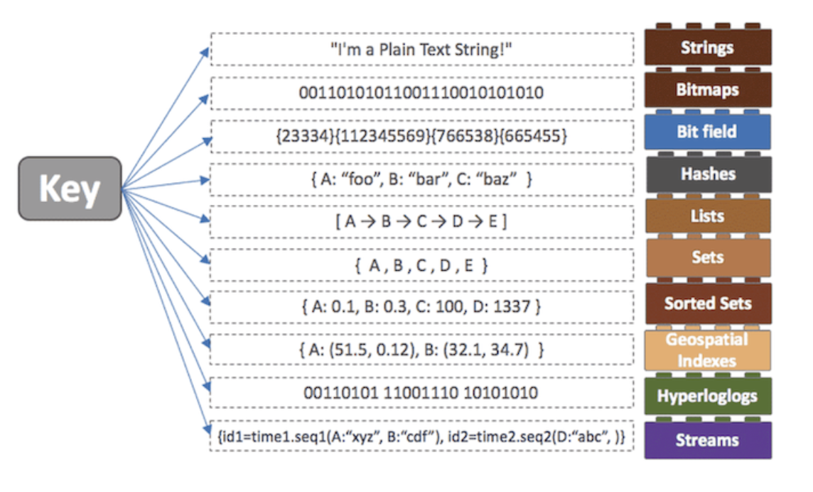
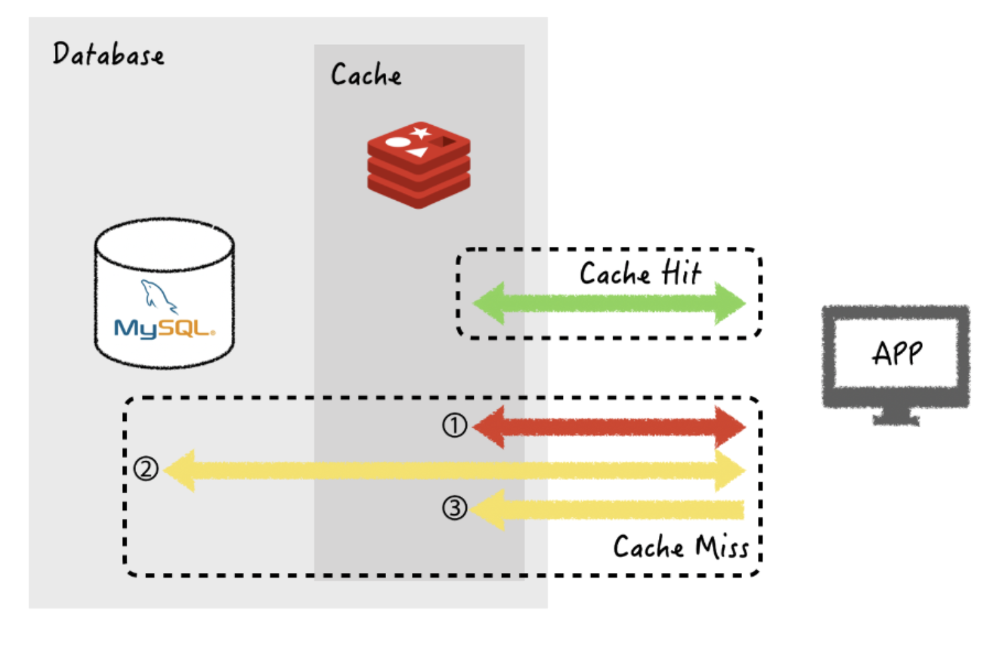

# Redis

Redis(Remote Dictionary Storage,레디스)는 모든 데이터를 메모리에 저장하고 조회하는 in-memory DB, 모든 데이터를 메모리로 불러와서 처리하는 메모리 기반의 key-value 구조의 데이터 관리 시스템(DBMS)이다. 일종의 NoSQL

# 개요

레디스는 빠른 오픈 소스인 메모리 키 값 데이터 구조 데이터베이스이다.
레디스는 다양한 인 메모리 구조 집합을 제공하므로 다양한 사용자 정의 애플리케이션을 손쉽게 정의할 수 있다. 
주요 레디스 사용 사례는 캐싱, 세션 관리, pub/sub 및 순위표를 들 수 있다. 레디스는 현재 가장 인기있는 키-값 스토어이다. 
레디스는 속도가 빠르고 사용이 간편하여 최고의 성능이 필요한 웹, 모바일, 게임, 광고 기술 및 IoT 애플리캐이션에서 널리 사용된다. 
AWS는 레디스용 Amazon ElaastiZCache라는 최적화된 완전관리형 데이터베이스 서비스를 통해 레디스를 지원하며, 사용자가 원하는 경우에는 AWS EC2에서 자체 관리형 레디스를 실행할 수도 있다.

# 역사

레디스 프로젝트는 최초 개발자인 살바토르 산필리포(Salvatore Sanfilippo)가 이탈리아 웹사이트를 확장성을 향상시키고 실시간 웹 로그 분석기를 개발하려고 할때 시작 되었다.
프로젝트는 깃허브와 인스타그램을 채택한 최초의 회사 중 하나인 루비 커뮤니티에서 더욱 주목 받았다. 2015년 06월에 레디스 Las가 후원했다. 2018년 10월에 레디스 5.0이 출시되었다. Redis Stream은 단일 키에서 자동 시간 기준 시퀀스(Sequence)를 사용하여 여러 필드와 문자열 값을 저장할 수 있는 새로운 데이터 구조이다.

~~사실 역사는 크게 중요하지 않다...심심하면 읽어보자~~

# 레디스의 대표적인 특징(장점)

## 인 메모리 데이터베이스

레디스는 디스크가 아닌 메모리 기반의 데이터 저장소이다. 데이터 대부분을 디스크 또는 SSD에 저장하는 다른 데이터베이스와는 달리 모든 레디스 데이터는 서버의 주 메모리에 상주한다.
작업을 위해 대부분 디스크까지 왕복해야 하는 전통적인 디스크 기반 데이터베이스와 대조적으로, 레디스와 같은 인 메모리 데이터 스토어는 이와 같은 단점이 없다.
NoSQL & Cache 솔루션이며 메모리 기반으로 구성된다. 명시적으로 삭제를 설정하지 않으면 데이터는 삭제되지 않는 영구적 보존이다.
여러 대의 서버로 구성이 가능하며 데이터베이스로도 사용할 수 있고, cache 서버로도 사용할수 있다. 성능은 서버에 따라 다르지만 1초당 수백만건의 작업이 가능하다.
메모리 위에서 동작하는 레디스는 NoSQL DBMS로 분류되며 동시에 Memcached와 같은 인메모리(In-memory) 솔루션으로 분리된다. NoSQL 중에서도 레디스가 주목을 받는 이유는 데이터 저장소로 입력/출력이 가장 빠른 메모리를 채택하고 단순한 구조의 데이터 모델을 사용하여 속도가 빠르다. 그리고 캐시 및 데이터 스토어에 유리하고 다양한 API를 지원한다. 레디스는 대형 서비스 업체들이 사용자들의 대규모 메시지를 실시간으로 처리하기 위해서 사용하고 있다. 레디스와 멤캐시드(Memcashed)는 특징이 유사하다.

### 멤캐시드 특징

데이터가 메모리에만 저장되어 속도가 느린 디스크를 커치지 않으므로 처리 속도가 매우 빠르다. 메모리에 데이터가 있으므로 프로세스가 죽거나 장비가 셧다운되면 데이터가 사라진다. 캐시기 때문에 만료일을 지정하여 만료되면 자동으로 데이터가 사라진다. 만료가 되지 않더라도 더 이상 데이터를 넣을 메모리가 없다면 LRU(Least recently used) 알고리즘에 의해서 가장 마지막에 쓰인 데이터를 삭제하여 저장소 메모리를 재사용한다. 그래서 보통 대형 포털 사이트에서 검색 결과 등을 캐시 하는데 많이 사용한다.

### 맴캐시드와 레디스 비교!

## 5가지형 자료구조를 지원

> Redis가 지원하는 데이터 형식은 String, Set, Sorted, Hash, List가 있다.

다양한 자료구조를 지원하게 되면 개발의 편의성이 좋아지고 난이도 낮아진다.

예를들어서, 수 많은 사용자가 서비스를 이용하는 빅테크기업에서... 생년월일 순으로 데이터를 정렬을 해야하는 상황이 있을 때 DBMS를 이용한다면 DB에 데이터를 저장하고 -> 저장된 데이터를 order by로 정렬하여 -> 다시 읽어오는 과정은 디스크에 직접 접근을 해야해서 저장된 사용자의 수가 많을 수록 오래걸리는 단점이있다.

하지만! In memory DB인 Redis를 이용하고 Redis에 제공하는 Sorted Set이라는 자료구조를 사용하면 더 빠르고 간단하게 데이터를 정렬할 수 있다.

Strings는 값에 문자, 숫자등을 저장하고 저장 시에 별도로 숫자, 문자 구분이 없다. 숫자도 저장이 가능하며 숫자에 incr(특정수를 더할때), incrby(특정수를 뺄때) 같은 연산이 가능하다.

Lists는 값에 리스트를 작성한다.

Sets 는 값을 집합(set)형태로 가지고 있다.

(Lists는 중복이 가능하지만 Sets는 중복이 되지 않는다.)

Hashes는 Hashs key/value 목록을 값으로 가진다.

Sorted sets는 값을 집합 형태로 가지고 있는다. Sets와 마찬가지로 중복은 안되지만 정렬이 된다는 장점이 있다.

Bitmaps는 비트값(bit)을 저장해준다. 512MB의 용량으론 42억개의 비트값들을 저장할수 있다.

## 리스트 형 데이터 입력과 삭제의 미친 빠름

리스트, 배열과 같은 데이터를 처리하는 데 유용하다. 밸류(value) 값으로 문자열, 리스트, Set, Sorted set, Hash 등 여러 데이터 형식을 지원한다. 따라서 다양한 방식으로 데이터를 활용할 수 있다. 리스트형 데이터 입력과 삭제가 MySQL에 비해서 10배 정도 빠르다고 한다.

## 기본-복제 아키텍처를 제공(복구기능 및 확장)

레디스는 기본-복제 아키텍처(architecture)를 사용하며 비동기식 복제를 지원하므로 데이터가 여러 복제 서버에 복제될 수 있다. 따라서 주 서버에 장애가 발생하는 경우 요청이 여러 서버로 분산될 수 있음으로 향상된 읽기 성능과 더 빠른 복구 기능을 사용할 수 있다.

그리고 단일 노드 또는 클러스터링된 토폴로지에서도 기본-복제 아키텍처를 제공한다. 따라서 가용성이 뛰어난 솔루션을 구축하여 일관된 성능과 안정성을 사용할 수 있다. 클러스터 크기를 조정해야할 경우 스케일업(scale-up), 스케일인(scale-in), 스케일아웃(scale-out)할 다양한 옵션이 있다. 따라서 수요에 맞춰 클러스터를 확장할 수 있다.

## 메모리를 활용하면서 영속성 데이터 보존

얼핏 들어보면 말이 안되는 것처럼 보이지만. 스냅샷(기억장치) 기능을 제공하여 메모리의 내용을 .rdb 파일로 저장하여 해당시점으로 복구할 수 있다. 즉, 명령어로 삭제,만료를 설정하지 않으면 영구적이라는 말이다.

## Single Thread(싱글스레드)

레디스는 싱글 스레드 아키텍쳐를 사용한다. 1번에 1개의 명령어만 실행한다. 레디스와 자주 비교되는 Memcached는 멀티 스레드를 지원한다. Keys(저장된 모든키를 보여주는 명령어)나 flushall(모든 데이터 삭제) 등의 명령어를 사용할 때 Memcached 같은 경우에는 1ms초가 소요되지만 레디스의 경우 100만건의 데이터 기준 1000ms로 속도차이가 크다.

즉, 하나의 요청에 병목이되면 그 다음 요청이 계속 대기가 되므로 O(N)관련 명령어를 주의해야한다. O(N)관련 명령어로는 위에서 언급한 Keys, flushall를 포함해 FLUSHDB, Delete COlLECTIONS, Get All Collections가 있다. 큰 컬렉션의 데이터를 다 가져오는 경우 등도 주의해야한다.

또 RDB 작업(특정 간격마다 모든 데이터를 디스크에 저장)이 매우 오래걸린다. AWS 60기가 메모리 기준으로 10분이나 소요된다고 한다. Redis 장애에 원인의 대부분이 해당 기능 때문에 발생하기 때문에 사용할 때 주의해야한다.

레디스는 Event Loop(이벤트 루프)를 이용하여 요청을 수행한다. 실제 명령에 대한 작업은 커널 I/O 레벨에서 멀티플렉싱(Multiplexing)을 통해 처리하여 동시성을 보장한다. 따라서 유저레벨에서는 싱글 스레드로 동작하지만 커널 I/O에서는 **스레드풀**을 이용한다.

### 스레드 풀에 대한게 궁금하다면?

[Thread Pool 이뭐야?](https://velog.io/write?id=cfba185a-1e18-4f88-b510-4144c95f0e90)

1개의 싱글 스레드로 수행이 되므로 서버 하나에 여러 개의 서버를 띄우는 것이 가능하다. Master-Slave 형식으로 구성이 가능하다. Master-Slave 방식으로 데이터 분실 위험을 없애준다.

## 짧은 코드 작성으로 애플리케이션의 데이터 저장 가능

레디스에서는 더 짧은 코드 작성으로도 애플리케이션(Application)의 데이터를 저장, 액세스 및 사용할 수 있음으로 코드가 간소화된다. 예를 들어 애플리케이션의 데이터가 해시맵에 저장되어 있는데 이를 데이터 스토어에 저장하려는 경우, 레디스 해시 데이터 구조를 사용하면 간단하게 데이터를 저장할 수 있다. 해시 데이터 구조가 없는 데이터 스토어에서 유사한 작업을 수행하려면 형식을 변환하기 위해 더 긴 코드가 필요하다.

# 좋은 점이 있으면 단점도 있겠지?

## 메모리를 2배를 사용

## 싱글 스레드

싱글 스레드라서 스냅샷을 뜰 떄 자식 프로세스를 하나 만들어낸 후 새로 변경된 메모리 페이지를 복사해서 사용한다.

## copy-on-write 방식

보통 레디스를 사용할 때는 데이터 변경이 자주 있기 때문에 실제 메모리 만큼 자식 프로세스가 복사하게 해서 사용하게 된다. 그러면 실제로 필요한 메모리양 보다 더 많은 메모리를 잡아먹게 된다.

## 대규모 트래픽으로 인한 속도 불안정

대규모 트래픽으로 인해 많은 데이터가 업데이트되면 레디스는 Memcached에 비해서 속도가 불안정하다. 이것은 레디스와 Memcached 의 메모리 할당 구조가 다르기 때문에 발생하는 현상이다.

## 메모리 파편화 발생

jemalloc을 사용하기 때문에 매번 malloc과 free를 통해서 메모리 할당이 이루어진다. 반면 Memcached는 slab 할당자를 이용하여 내부적으로는 메모리 재할당을 하지 않고 관리하는 형태를 취한다. 이로 인해 레디스는 메모리 파편화가 발생하여 이 할당 비용 때문에 응답 속도가 느려진다. 다만 이는 극단적으로 봤을 때 발생하는 일이다. 대규모 서비스에서도 레디스를 많이 도입하는 것을 보면 일반적으로 스타트업 등에서 사용하여도 무방하다 볼 수 있다.

> 보통 많은 사람들이 Memcached랑 비교를 많이하는데 다음

# CRUD에 따른 Redis 데이터 처리

레디스 서버는 클라이언트에서 Read 요청이 들어올 때 메인 서버로부터 값을 가져와 저장한다. 이때 메인 서버와 싱크된 데이터 이외에 추가로 데이터 민료시점을 처리하기 위해서 현재시간이나 만료시간을 함께 저장한다.

## Read 요청시

레디스 서버에서 사용자가 요청한 데이터가 있는지 확인한다. 데이터가 존재하는 경우 만료 여부를 확인하고 정보를 반환한다. 정보 반환시간을 현재로 업데이트한 후 데이터가 만료되었거나 없을 경우 삭제후 메인 서버에 요청한다 메인서버로부터 받은 데이터를 캐싱 및 DB에 저장한 후 이값을 방문자에게 반환 후 종료한다.

## CUD 요청시

이 경우는 Read 과정과 조금 다르다. 그 이유는 데이터에 변화가 생겼으므로 해당하는 값의 데이터는 캐싱 값이 아닌 현재 실시간 정보를 보내줘야한다. 그러기 위해 필요한 조치는 비교적 간단하다. 방문자의 CUD를 메인 서버에 요청을 하고 메인 서버는 요청받은 CUD를 처리하고 업데이트 한다. 그리고 변경되지 전의 데이터 값은 레디스 서버에서 찾아서 삭제후 종료한다. **여기서 가장 중요한 점은** 캐싱을 제공하는 경우 단순하게 정보를 제공하는 부분만 고려하는 것이 아니라 다양한 상황에서 대처해야한다는 점이다. 예를들어 CUD처럼 데이터에 중요한 변경 사항이 있을 경우엔 기존 캐시이 데이터를 삭제하는 과정을 들 수 있다.

# 활용

> 이미 대형 서비스 기업들이 사용중이다... 예를들어서 페이스북, 인스타그램, 네이버 라인, 블리자드, StackOverFlow 등... 사용자들의 대규모 메시지를 실시간으로 처리하기 위하여 사용하고 있다.
> 
> 구체적으로 활용할 수 있는 부분을 설명하겠다.

## 캐싱 전략:Look Aside ( = Lazy Loading )

캐시를 옆에 두고 필요할 때만 데이터를 캐시에 로드하는 전략이다. ( key-value 형태로 저장됨 )

1.데이터 가져오는 요청

2.Redis에 먼저 요청 -> 있으면 반환

3.없으면 데이터베이스에 데이터 요청

4.이 데이터를 레디스에 저장

레디스는 데이터 접근 시간을 줄이고, 처리량을 늘리며, 관계형 데이터베이스 또는 NoSQL 데이터베이스와 애플리케이션의 로드를 줄일 수 있는 가용성이 뛰어난 인메모리 캐시(In Memory Cache)구현에 적합하다. 레디스를 사용하면 빈번하게 요청되는 항목을 1ms 초안으로 처리할 수 있으며 고가의 백엔드를 추가 하지 않아도 손쉽게 확장하여 더 많은 로드를 처리할 수 있다.

## 채팅, 메시징 및 대기열

레디스는 패턴 매칭과 다양한 구조옵션으로 게시/구독을 사용할 수 있다. 따라서 레디스에서는 고성능 채팅방, 실시간 코멘드 스트림, 소셜 미디어 피드 및 서버 상호 통신을 지원한다. 레디스 목록 데이터 구조를 사용하면 간단한 대기열을 손쉽게 구현할 수 있다. 목록은 자동 작업 및 차단 기능을 제공하므로 신뢰할 수 있는 메시지 브로커 또는 순환 목록이 필요한 다양한 애플리케이션에 적합하다.

## 다양한 미디어 스트리밍

레디스는 라이브 스트리밍 사용 사례를 지원할 수 있는 빠른 인 메모리 데이터 스토어를 제공한다. 레디스는 CDN(Contents Delivery Network)이 동시에 수백만 명의 모바일 및 데스크톱 사용자에게 비디오를 스트리밍할 수 있도록 사용자 프로필 및 열람 기록에 대한 메타데이터, 수백만 사용자의 인증 정보/토큰, 매니페스트 파일을 저장하는 데 사용할 수 있다.

## 지리 공간

레디스는 대규모의 실시간 지리 공간 데이터를 빠르게 관리할 수 있도록 특별히 구축된 인 메모리 데이터 구조 및 연산자를 제공한다. 지리 공간 데이터를 실시간으로 저장, 처리 및 분석하는 명령을 사용하면 레디스에서 쉽고 빠르게 지리 공간을 처리할 수 있다. 레디스를 사용하여 주행 시간, 주행 거리, 안내 표시와 같은 위치 기반 기능을 애플리케이션에 추가할 수 있다.

## 실시간 분석

레디스는 스트리밍 솔루션에 인 메모리 데이터 스토어로 사용하여 1밀리초 미만의 지연 시간으로 실시간 데이터를 수집, 처리 및 분석할 수 있다. 레디스는 소셜 미디어 분석, 광고 타게팅(Targeting), 개인화 및 IoT와 같은 실시간 분석 사용 사례에 적합하다.

# 활용 사례

## 좋아요 처리하기

좋아요 처리에서 가장 중요한 것은 한 사용자가 하나의 댓글에 좋아요를 한 번 씩만 사용할 수 있는 것이다. RDBMS에서는 유니크 조건을 걸어서 구현할 수 있지만, 인서트와 업데이트가 자주 발생하는 경우 RDBMS 성능 저하가 필연적으로 발생하게 된다. 레디스 Sets를 이용하면 간단하게 구현 할수 있고 빠른 시간안에 처리할 수 있다. 댓글의 번호를 key로 하고 해당 댓글을 좋아요 누른 회원 ID를 value로 추가하면 조건을 만조고 할 수 있다.

## 일일 순 방문자수 구하기

순 방문자 수는 서비스에 사용자가 하루에 여러 번 방문했더라도 한 번만 카운팅 되는 값이다. 이를 구현하기 위해서는 구글 애널리틱스(Analytics)와 같은 외부 서비스를 이용하거나 접속 정보를 로그 파일로 작성하여 배치 프로그램을 작성하는 방법들이 있다. 레디스의 비트 연산을 활용하면 간단하게 실시간 순 방문자를 저장하고 조회하는 방법을 구현할 수 있다.

## 출석 이벤트 구현하기

일일순 방문자 수 구하기를 이용해 매일 방문자를 구현하고, 구해놓은 String 간의 비트를 비교하는 BITOP 커맨드를 사용하면 이서비스를 구현할수 있다.

# 사용시 주의할 점

레디스는 인메모리 데이터 저장소로서 서버에 장애가 났을 경우 데이터 유실이 발생한다. 따라서 스냅샷(Snapshot)과 에이오에프(AOF) 기능을 통한 복구 시나리오가 제대로 세워져 있어야 데이터 유실에 대비한 사고에 대처할 수 있다. 그리고 캐시 솔루션으로 사용할 시 잘못된 데이터가 캐시 되는 것을 방지, 예방해야 한다. ~~어디서 줏어 들은 이야긴데 회사에서 레디스를 운영 중 전 개발자의 실수로 작성된 로직(logic)으로 캐시 데이터가 잘못 캐싱(caching)되어 올바르지 않은 데이터가 꺼내져 한동안 데이터가 꼬이는 일이 있었다.~~레디스와 캐싱하고자 하는 데이터 저장소의 데이터가 서로 일치하는지 주기적인 모니터링과 이를 방지하기 위한 사내 솔루션을 개발하는 것이 좋다.
